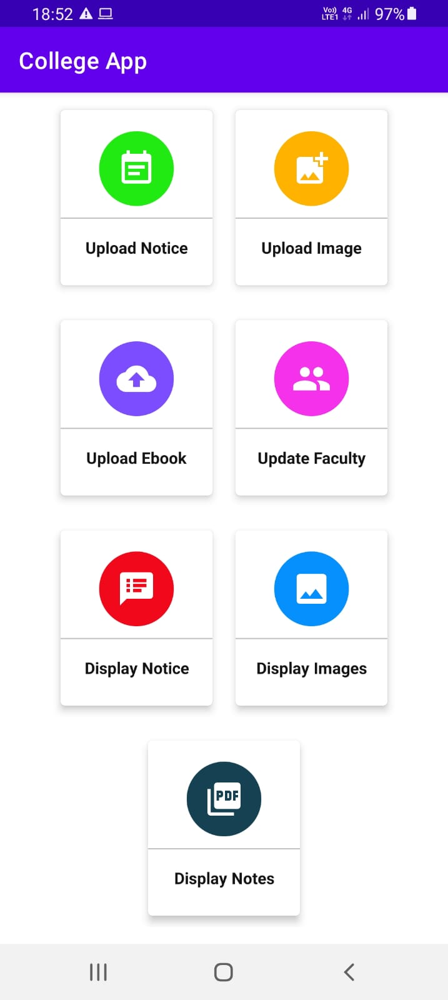
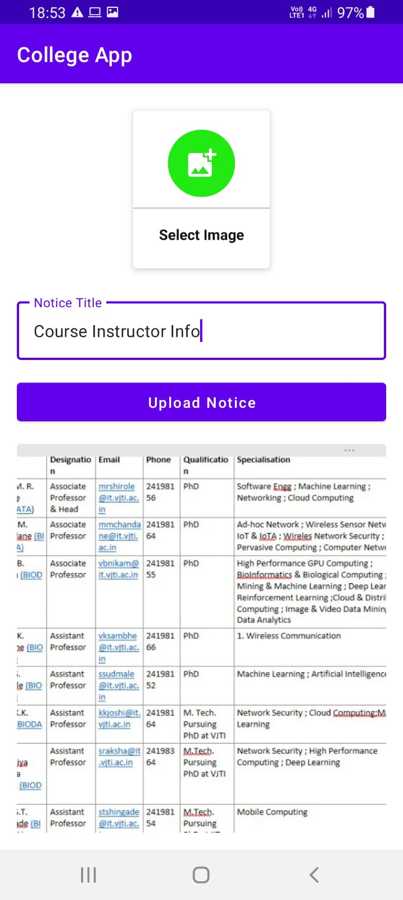
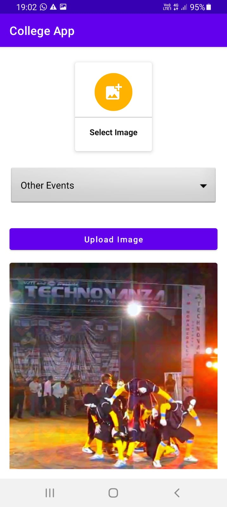
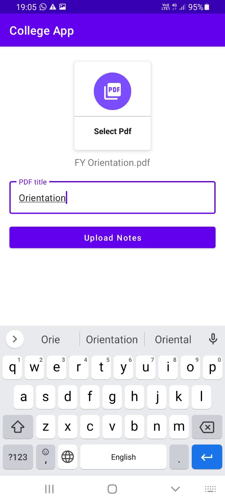
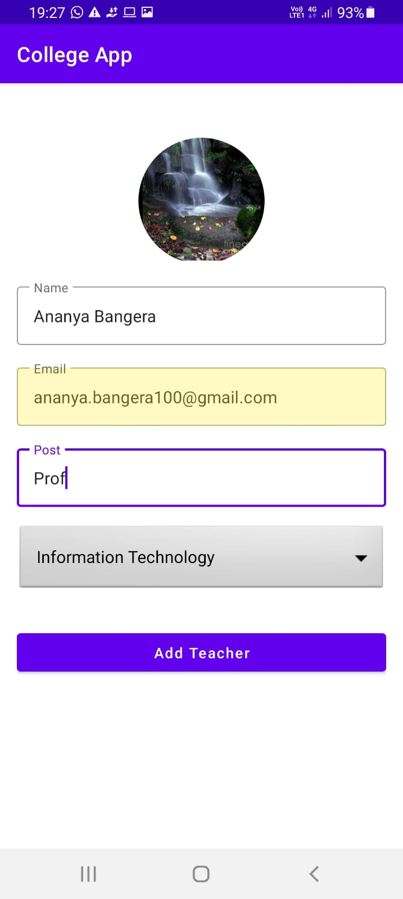
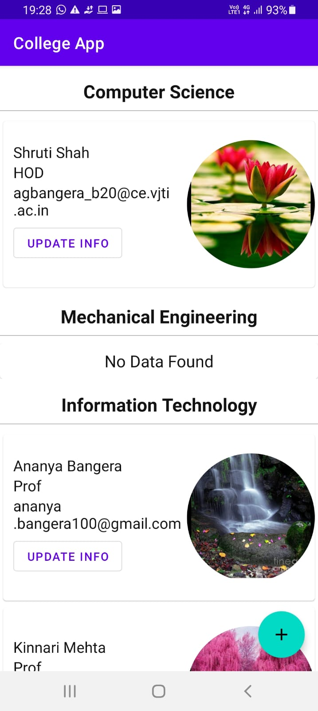
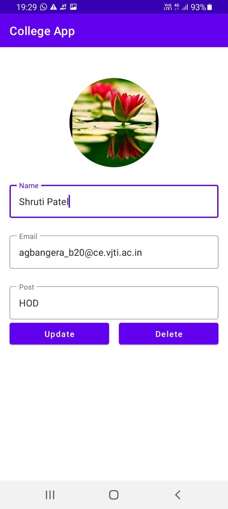
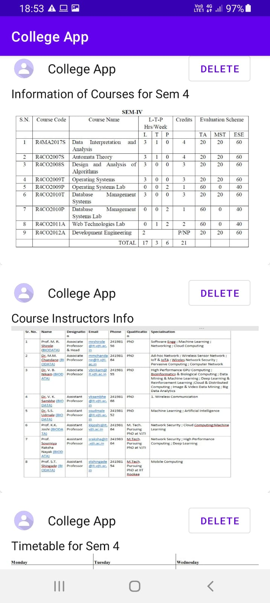
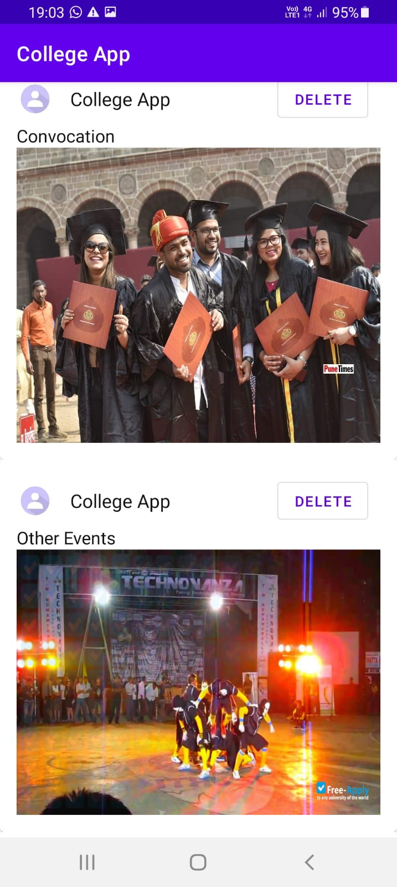
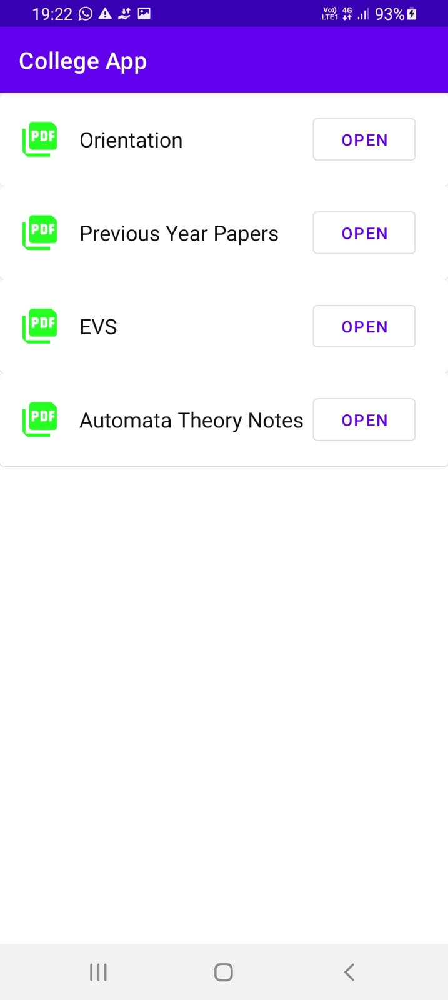

# College-App : Android-Study-Jams

College Data Storage System

<b> Problem Statement: </b>

Over a great period, many issues have been faced by our students due to college in online mode. 
A proper system to store data such as :
- [x] Notice
- [x] Images of different events organised by the institute 
- [x] Ebooks uploaded by the professors and classmates 
 
Technology plays a vital role in day-to-day life activities which in turn made great changes in many work fields and out of them Mobile Application is one of the major developments. Mobile Application can be used effectively for this job as they are widely used and are known for easy access.
 
<b> Proposed Solution : </b>

This project proposes a “College Data Storage System” to keep track of the college information.
Its features include:
- [x] Uploading , Displaying and Deleting of Notice (A substitute for physical notice boards)
- [x] Announcements of future events and Pics of Past Events 
- [x] Uploading and Displaying of Ebooks (A substitute for Hard copies of notes)
- [x] Inserting, Updating and Displaying of Faculty Info
 
 

<table>
  <tr>
    <td><b> Home Page UI </b></td>
  </tr>
  <tr>
    <td>></td>
  </tr>
 </table>
  
  
 <b>Uploading Features UI</b>
  
<table>
  <tr>
    <td><b> Upload Notice UI </b></td>
     <td><b> Upload Event Images UI </b></td>
     <td><b> Upload Ebook UI </b></td>
    <td><b> Insert Faculty UI </b></td>
  </tr>
  <tr>
    <td></td>
    <td></td>
    <td></td>
    <td></td>
  </tr>
 </table>
  
  
  <b>Faculty Data</b>
  
 <table>
  <tr>
    <td><b> Displaying Faculty Details Before Updating</b></td>
     <td><b> Updating Faculty Details </b></td>
     <td><b> Displaying Faculty Details After Updating</b></td>
  </tr>
  <tr>
    <td></td>
    <td></td>
    <td></td>
  </tr>
 </table>
   
  
 <b>Displaying Features UI</b>
  
<table>
  <tr>
    <td><b> Display Notice UI </b></td>
     <td><b> Display Events Images UI </b></td>
     <td><b> Display Ebook UI </b></td>
  </tr>
  <tr>
    <td></td>
    <td></td>
    <td></td>
  </tr>
 </table>
  
  
<b> Functionality & Concepts used : </b>

- The App has a very simple ,user-friendly and interactive interface which helps the students to get updated college info , free notes(can be uploaded by professor or any class mate) and Faculty Info. Following are few android concepts used to achieve the functionalities in app : 
- Constraint Layout : Most of the activities in the app uses a flexible constraint layout, which is easy to handle for different screen sizes.
- Simple & Easy Views Design : Use of familiar audience EditText with hints and interactive buttons made it easier for students as well as for the faculty
- Attractive UI which conveniences the user to explore more about the app
- RecyclerView : To present the list of different notices, event images , ebooks and faculty details we used the efficient recyclerview.

<b> Application Link & Future Scope: </b>

The app is currently in the Alpha testing phase with GNITS institute with a limited no. of users, You can access the app : [YOUR APP LINK HERE](either Github link or Google Play store link of published app or .apk file).

This app basically helps students to stay tuned with the college info inspite of teaching mode being online. The app contains the latest college info which is beneficial to students as they won't miss out any Important info. Ebooks uploaded in this app can be directly downloaded by the user into their device which helps the Professors as well as classmates to share resources. The Faculty details provided by the app helps students to get to know about the concerned faculty

